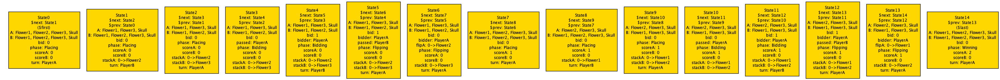
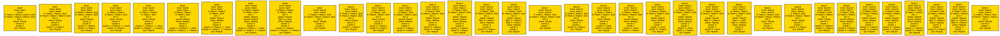

# Formalizing the Game of Skull in Alloy

An [Alloy](https://alloytools.org/) model of the two-player bluffing card game **Skull** — placing, bidding, flipping, and win/loss conditions are all captured as relational constraints, and Alloy's SAT backend is used to find and check traces of full games.

## Explore the traces

The two counterexample-style traces below are easiest to read state-by-state rather than as one long strip. Open the interactive viewer to swipe through them one `State` at a time:

**👉 [Open the interactive trace viewer](https://hxchen666.github.io/formalizing_skull/)**

| | |
|---|---|
| **Trace 1 · Minimal win (15 states)** — the shortest game Alloy could find: both players place exactly one card, the top bid is 1, no Skull is ever flipped, and PlayerA wins 2–0. | **Trace 2 · Skull lost, still wins (35 states)** — a counterexample trace where a player loses their Skull early on but still comes back to win two rounds. |
| [] | [] |
| *(click to open full resolution)* | *(click to open full resolution)* |

## System overview

Skull is a bluffing card game. This model considers a two-player version with `PlayerA` and `PlayerB`. Each player starts with four cards — three `Flower`s and one `Skull` — and the game proceeds through four phases: **Placing**, **Bidding**, **Flipping**, and **Winning**. The first player to win two points is declared the winner.

## Model structure

### Signatures

| Signature | Description |
|---|---|
| `Player` | Abstract type extended by `PlayerA` and `PlayerB`. |
| `Card` | Abstract type with one `Skull` and three `Flower`s. |
| `Phase` | Game phases: `Placing`, `Bidding`, `Flipping`, `Winning`. |
| `State` | A snapshot of the game: hands, card stacks, flip zones, current phase, turn, bidding status, and scores. |

### Predicates and functions

| Name | What it does |
|---|---|
| `Init` | All cards in hand, no stack/flip cards, no active bid, phase `Placing`, `PlayerA` starts. |
| `otherPlayer` | Returns the opponent of a given player. |
| `PlaceCard` | A player moves one or more cards from hand to their stack; turn passes to the other player. |
| `PassPlace` | A player passes instead of placing, once both players have placed at least one card (or have none left); moves to `Bidding`. |
| `Bid` | A player raises the bid — first bid is 1..totalPlaced, later bids must strictly increase, capped at the total cards placed. |
| `PassBid` | A player passes on raising the bid; play moves to `Flipping`, starting with the bidder. |
| `Flip` | Sequentially flips cards to fulfill the bid, starting from the flipper's own stack and moving to the opponent's if needed, until the bid is met or a `Skull` is revealed. |
| `LoseCardA` / `LoseCardB` | A `Skull` was revealed: the flipper loses one random card from their pool; the opponent's cards are returned to hand; a new round begins. |
| `WinA` / `WinB` | The bidder fulfilled their bid with no `Skull` revealed: they score a point; game ends if they reach 2, otherwise a new round begins. |
| `Finish` | A terminal state — no active stacks/flips/bid, `Winning` phase, scores and hands held constant going forward. |
| `Game` | Chains all valid transitions from `Init` through `Placing`, `Bidding`, and `Flipping` to a `Winning` state. |

## Running the model

1. Install [Alloy Analyzer](https://alloytools.org/download.html) (6.x).
2. Open `final.als` and run any of the included commands:
   - `run Game for 40` — any valid game.
   - `run FifteenStateSolutionsExist for 15` — the minimal 15-state trace.
   - `check NoSolutionsLessThanFifteenStates for 15` — no game finishes in fewer than 15 states.
   - `check LosingSkullMeansNoWin for 40` — Alloy finds a counterexample here (see Trace 2 above): a player can lose their Skull and still win, refuting the assertion at this scope.
   - `check LosingSkullMeansNoWinMinimal for 15` — no counterexample at this smaller scope. Minimal-length traces never involve losing a card at all, so the assertion only holds vacuously here.

## Analysis highlights

- **What do minimal solutions look like?** The shortest valid trace is 15 states — both players place only one card, the highest bid is 1, and no Skulls are ever flipped. PlayerA (who always starts, and stays on serve after a win) wins both rounds in every minimal trace.
- **Does losing your Skull guarantee a loss?** No — Alloy finds traces where a player loses their Skull early but still wins in three rounds, showing that placing, bidding, and flipping decisions matter more than simply keeping all four cards.
- **In *minimal* solutions specifically, can a player who lost their Skull still win?** No — in the shortest traces no player ever loses a card, so the premise of the assertion is never triggered there; it holds only vacuously at that scope.

## Repository structure

```
.
├── README.md
├── final_model.als              # the Alloy model
├── final.pdf                    # full write-up (model explanation + analysis + retrospective)
├── docs/
│   └── index.html         # interactive swipeable trace viewer (GitHub Pages)
└── assets/
    ├── trace1.png    # full-res 15-state trace
    ├── trace2.png    # full-res 35-state trace
```
